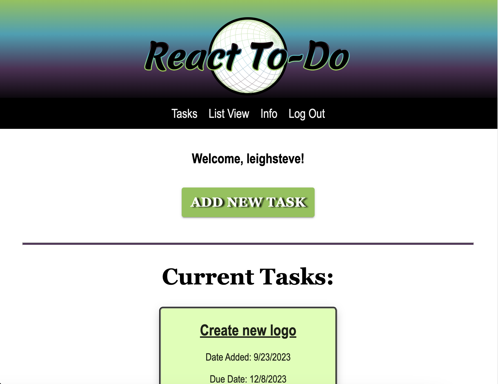
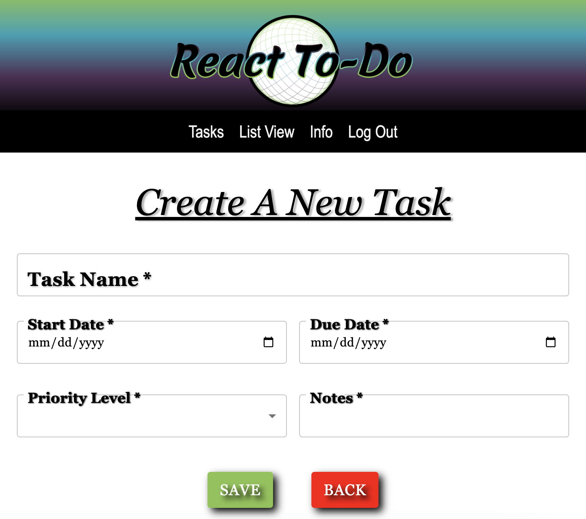

# LevieTech's React To-Do App
This version uses React, Redux, Express, Passport, and PostgreSQL (a full list of dependencies can be found in `package.json`).

## Description
This is a full-stack web application that allows users to keep track of various tasks they need to do. Users are required to input the name of the task, the start and end date, the priority level, and any additional notes. After a task is added, it is stored in a database and displayed on the DOM. Users are able to mark an item as complete and delete or edit it. Both of these actions update the database. 

## Preview
Task list preview:


Add new task preview:


## Prerequisites

Before you get started, make sure you have the following software installed on your computer:

- [Node.js](https://nodejs.org/en/)
- [PostrgeSQL](https://www.postgresql.org/)
- [Nodemon](https://nodemon.io/)

## Create database and table

Create a new database called `react-to-do` and create a `user` table:

```SQL
CREATE TABLE "user" (
    "id" SERIAL PRIMARY KEY,
    "username" VARCHAR (80) UNIQUE NOT NULL,
    "password" VARCHAR (1000) NOT NULL
);
```

If you would like to name your database something else, you will need to change `react-to-do` to the name of your new database name in `server/modules/pool.js`

You will need to register a user before you can create the next table. After registering a user, create a `tasklist` table:

```SQL
CREATE TABLE tasklist (
    "id" serial PRIMARY KEY,
    "user_id" INT REFERENCES users,
    "taskname" VARCHAR (400) NOT NULL,
    "dateadded" VARCHAR (50),
    "duedate" VARCHAR (50),
	  "prioritylevel" VARCHAR (10),
    "completionstatus" BOOLEAN DEFAULT FALSE,
    "notes" VARCHAR (2000)
);
```

## Development Setup Instructions

- Run `npm install`
- Create a `.env` file at the root of the project and paste this line into the file:
  ```
  SERVER_SESSION_SECRET=superDuperSecret
  ```
  While you're in your new `.env` file, take the time to replace `superDuperSecret` with some long random string like `25POUbVtx6RKVNWszd9ERB9Bb6` to keep your application secure. Here's a site that can help you: [https://passwordsgenerator.net/](https://passwordsgenerator.net/). If you don't do this step, create a secret with less than eight characters, or leave it as `superDuperSecret`, you will get a warning.
- Start postgres if not running already by using `brew services start postgresql`
- Run `npm run server`
- Run `npm run client`
- Navigate to `localhost:5999`

## Built With 
-React
-Redux
-Material Ui
-Node
-Axios
-Passport
-Postgres
-Positco

## Acknowledgement 
Shout out to Prime Digital Academy for bringing us togther and providing a template to work off of.

Thanks to the team of developers at LevieTech:
-Leigh Stephenson
-Julie Gonzalez-Kincaid
-Sam Gossie

Honorable Mention:
-Everett Butler
-Stephen Vertucci

## Support 
If you have any suggestions or issues, please contact any of the developers on LinkedIn or email Leigh at leighh.stephenson@gmail.com 

Thanks for viewing!